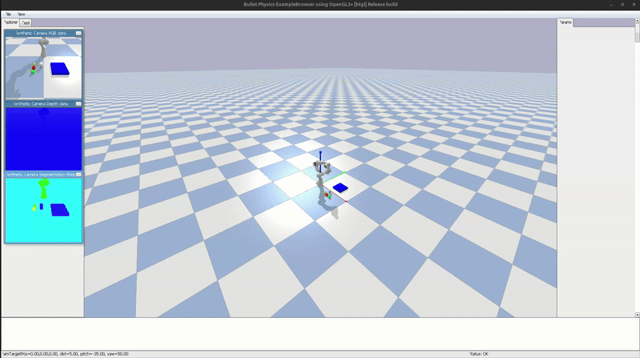

SimVLA Pilot
==============================

Vision-Language-Action sandbox that connects a PyBullet Franka Panda scene, YOLOv8 perception, a mock LLM parser, and a planner-driven controller via ROS 2.

Demo
----

Components
----------
- Simulation: `vla_simulation` spins up PyBullet, camera publishing, and joint control endpoints.
- Perception: `vla_perception` runs YOLOv8 plus color fallback to publish detections.
- Brain: `vla_brain` provides a mock LLM task parser and a planner that turns tasks into joint commands.
- Launch: `ros2 launch vla_simulation vla_system.launch.py use_gui:=True` starts the whole stack.

Getting Started
---------------
1. `python3 -m venv venv && source venv/bin/activate`
2. `pip install -r requirements.txt` (ROS 2 provides `rclpy`)
3. `cd vla_ws && colcon build && source install/setup.bash`
4. `ros2 launch vla_simulation vla_system.launch.py use_gui:=True`

